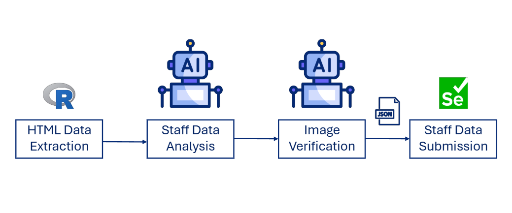

# AI Automator

**AI Automator** is an internal Python tool that automates staff requests. It leverages Crew AI and **Gemini 2.5 Flash** to process data and uses Selenium to automate task execution.



## Features

- Extracts information from live websites.
- Processes data using Gemini 2.5 Flash and Crew AI.
- Automates logins, tool integrations, and task execution using Selenium.
- Selective step execution with arguments.

---

## Installation

### 1. Clone the repository

```bash
git clone https://github.com/dot-sky/ai_automator.git
cd ai_automator
```

### 2. Install python dependencies:

```bash
pip install -r requirements.txt
```

This will install all required Python dependencies.

### 3. Install R (required for data extraction)

1. Download and install R from [CRAN](https://cran.r-project.org/bin/windows/base/).
2. During installation, take note of the installation path (by default it will be something like `C:\Program Files\R\R-4.x.x\bin`).
3. Add R to your Windows **Environment Variables**:
   - Press **Win + R**, type `sysdm.cpl`, and press Enter.
   - Go to the **Advanced** tab → **Environment Variables**.
   - Under **System variables**, find and select **Path**, then click **Edit**.
   - Click **New** and add the path to R’s `bin` folder (e.g., `C:\Program Files\R\R-4.x.x\bin`).
   - Click **OK** to save.
4. Open the **R console** (from Start Menu or by typing `R` in a new terminal).
5. Install the required `rvest` package by running:

   ```R
   install.packages("rvest")
   ```

## Usage

1. After installation, run the tool from the command line:

   ```bash
   python main.py
   ```

   This executes the default workflow (all steps).

2. On first run, the app will prompt you for credentials:

   - DDC credentials
   - Cox credentials
   - Gemini API key (get yours here: [AI Studio](https://aistudio.google.com/app/apikey) )

   These credentials will be stored for reuse.

3. Provide the Live Site URL and DDC site ID when prompted.

**Optional**
To execute specific steps only, pass one or more arguments:

```bash
python main.py e       # only extract
python main.py p       # only process
python main.py s       # only submit
python main.py ep      # extract + process
python main.py a       # run all steps (same as no args)
```

Available step arguments:

- `e`: extract staff data
- `p`: process data with AI
- `s`: submit data
- `a`: run all steps

## FAQ

- Live site: URL of the site containing staff information

- DDC ID: ID of the DDC site where staff data will be submitted

- DDC username: Composer site username

## Requirements

### Python dependencies

All required Python libraries are automatically installed via `pip`:

- `crewai==0.175.0`
- `ipython==8.12.3`
- `keyring==25.6.0`
- `protobuf==6.32.0`
- `python-dotenv==1.1.1`
- `requests==2.32.5`
- `selenium==4.35.0`
- `traitlets==5.14.3`
- `wcwidth==0.2.13`
- `webdriver_manager==4.0.2`

### External dependencies

- R runtime (latest stable version)
- R package: `rvest`
